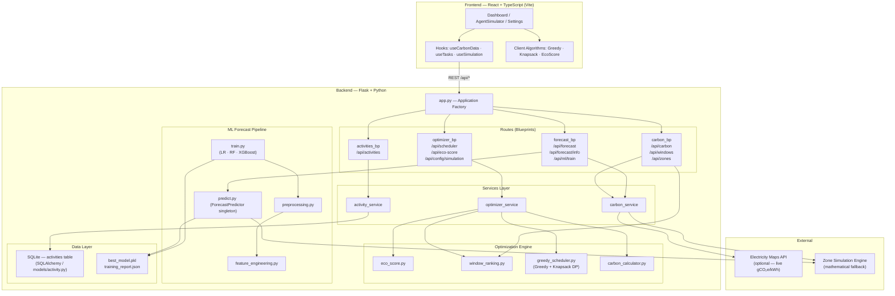

# Diagram 1 — Overall System Architecture

**Description:** High-level view of the two-tier EcoTime system: React/TypeScript frontend
communicating with the Flask/Python backend over a REST API. Shows external integration
with Electricity Maps API, SQLite persistence, and the ML subsystem.

**Recommended placement:** BE Report — Section 1 (Introduction/Overview); IEEE Paper — Figure 1.

