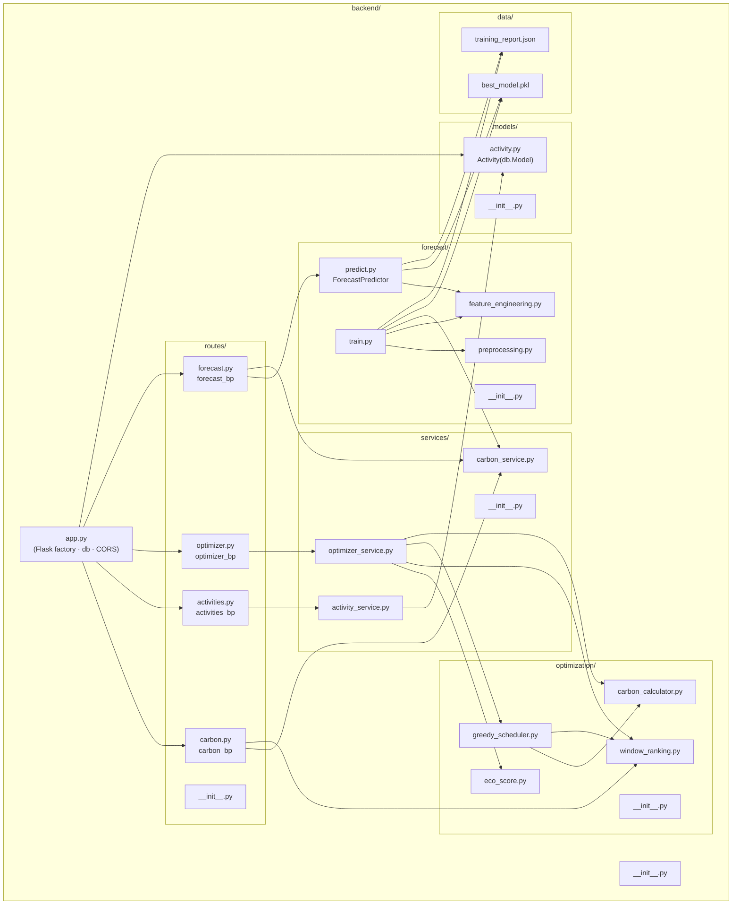

# Diagram 2 — Component Diagram

**Description:** Shows the backend Python package hierarchy and inter-module dependencies
exactly as laid out in the `backend/` folder structure. Every node is a real file.

**Recommended placement:** BE Report — Section 3 (System Design); IEEE Paper — Figure 2.

