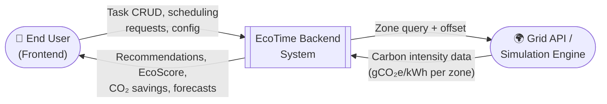
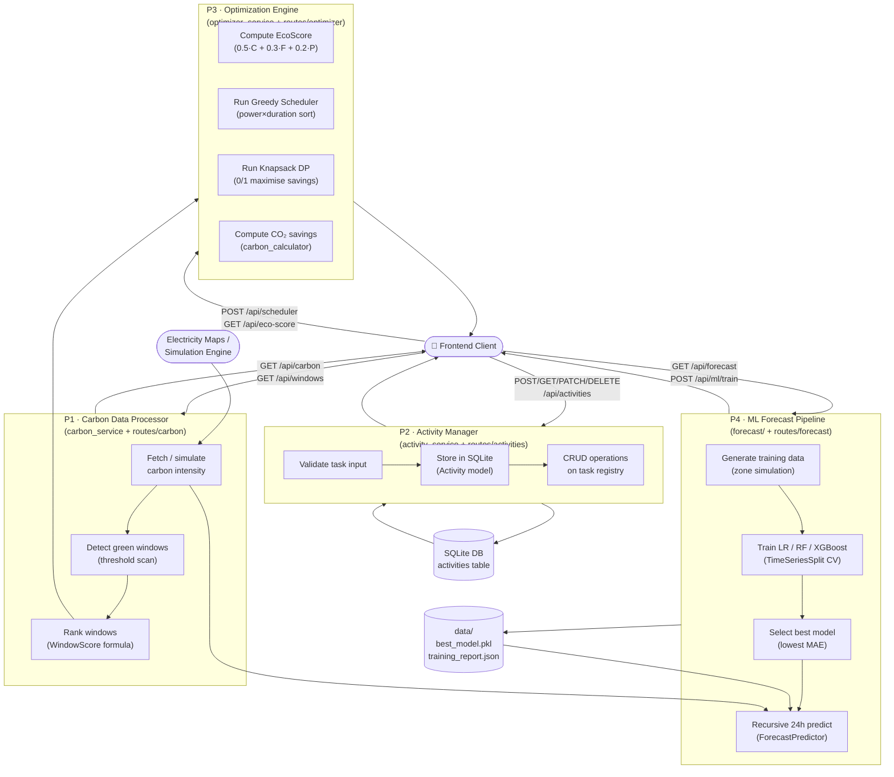

# Diagram 3 — Data Flow Diagram (Level 0 & Level 1)

**Description:** Level 0 (context) shows the system as a single process receiving inputs
from the user and external grid API. Level 1 decomposes the system into its four major
processing subsystems matching the four Flask blueprints.

**Recommended placement:** BE Report — Section 4 (Data Design); IEEE Paper — Figure 3.

---

## Level 0 — Context DFD

---

## Level 1 — DFD

