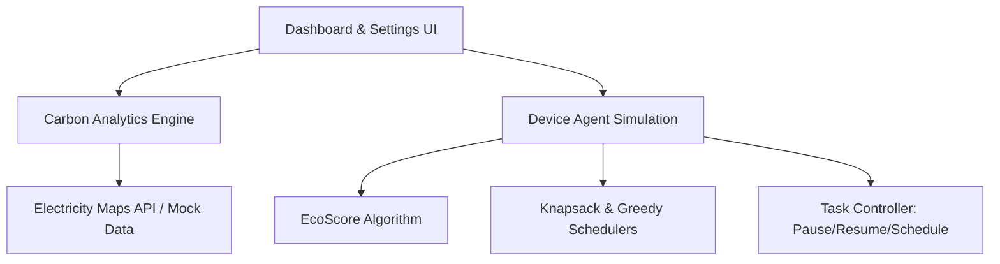

# EcoTime Implementation Plan

EcoTime is an intelligent carbon-aware scheduling and optimization platform that analyzes real-time and forecasted carbon intensity data, identifies Green Time Windows, and schedules digital activities (like file uploads, backups, software updates, and CI/CD pipelines) to minimize carbon footprint.

We will build EcoTime as a **Vite + React + TypeScript** web application using **Vanilla CSS** for a premium, highly aesthetic design (glassmorphism, modern gradients, micro-animations, and a cohesive dark mode palette).

---

## User Review Required

> [!IMPORTANT]
> **API Key & Simulation Mode**
> The Electricity Maps API requires a paid or trial API key for production access. To ensure a seamless, interactive, and fully functional out-of-the-box experience, EcoTime will feature:
> 1. **Simulation/Demo Mode (Default)**: Automatically runs with highly realistic, dynamic carbon intensity profiles for different regions.
> 2. **Real-time API Mode**: An option in the settings panel where you can paste your Electricity Maps API key to fetch real live data.

> [!TIP]
> **Vanilla CSS Aesthetics**
> We are using pure Vanilla CSS styled components (CSS Modules or a unified variables system) to construct a premium dark-themed interface with smooth hover effects, custom glass containers, and clean charts, without relying on Tailwind CSS.

---

## Open Questions

- Do you have an active Electricity Maps API token you'd like to pre-configure, or should we rely on the dynamic localStorage key input? (We will build the key input to support any key you might have).
- Are there specific types of custom tasks or integrations you want the simulated Device Agent to show (e.g., docker builds, heavy queries, file syncing)?

---

## Proposed Changes

We will initialize the project in the root of `c:\MAJOR_PROJECT` using Vite.

### 1. Project Initialization

#### [NEW] [package.json](file:///c:/MAJOR_PROJECT/package.json)
We will define dependencies including:
- `lucide-react` for beautiful, modern vector icons.
- `react` and `react-dom` for component structure.
- Developer tools (Vite, TypeScript).

#### [NEW] [vite.config.ts](file:///c:/MAJOR_PROJECT/vite.config.ts)
Vite configuration for building and running the project.

### 2. Styling Foundation

#### [NEW] [index.css](file:///c:/MAJOR_PROJECT/src/index.css)
Global styling definition:
- Premium typography (Inter / Outfit google fonts).
- Design system colors (deep slate backgrounds, emerald/green accents for low carbon, amber/yellow for moderate, rose/coral for high carbon, glassmorphism filters).
- Standard variables for padding, borders, shadows, and smooth transitions.

### 3. API & Data Layer

#### [NEW] [electricityMaps.ts](file:///c:/MAJOR_PROJECT/src/services/electricityMaps.ts)
Service for retrieving real-time and forecasted carbon data:
- Connects to Electricity Maps API if an API token is provided.
- Generates high-fidelity simulated datasets based on realistic diurnal cycles (e.g., solar peaks during the day, wind variance, base load) when in simulation mode.
- Supports regional zones (e.g., US-CA, DK-DK2, DE, FR, AU).

### 4. Core Algorithms

#### [NEW] [algorithms.ts](file:///c:/MAJOR_PROJECT/src/utils/algorithms.ts)
Contains the mathematical engines defined in the requirements:
1. **EcoScore**: `EcoScore = 0.5 * CarbonScore + 0.3 * FlexibilityScore + 0.2 * PriorityScore`
2. **Window Ranking**: `WindowScore = 0.5 * CarbonSaving + 0.3 * UserConvenience + 0.2 * Duration`
3. **Greedy Scheduler**: Sorts and schedules activities into windows based on carbon-saving potential.
4. **0/1 Knapsack Optimization**: Selects the optimal subset of tasks to fit within the duration of a specific green window to maximize total carbon savings.

### 5. Frontend Components

#### [NEW] [App.tsx](file:///c:/MAJOR_PROJECT/src/App.tsx)
The primary layout wrapper including navigation sidebar, settings panel, and route/tab views.

#### [NEW] [Dashboard.tsx](file:///c:/MAJOR_PROJECT/src/components/Dashboard.tsx)
The real-time monitoring and analytics panel:
- Main carbon gauge (current intensity, rating).
- Visual trend chart (SVG-based line graph showing current and forecasted carbon intensity, with Green Windows highlighted in light green).
- Forecast analyzer (lowest carbon periods, estimated savings).

#### [NEW] [AgentSimulator.tsx](file:///c:/MAJOR_PROJECT/src/components/AgentSimulator.tsx)
The task management and control panel:
- Tasks list with interactive status: flex vs. non-flex, priority, duration, power rating.
- Live console log output showing agent action ("*Paused Upload to AWS: carbon intensity is high (420g/kWh)*").
- Visual queue showing Knapsack vs. Greedy allocation.
- Pause/Resume/Schedule triggers.

#### [NEW] [SavingsCard.tsx](file:///c:/MAJOR_PROJECT/src/components/SavingsCard.tsx)
Environmental impact visualization:
- Total CO2 saved.
- Fun equivalence comparisons (e.g., smartphone charges saved, miles of driving avoided, tree seedlings grown).

---

## Verification Plan

### Automated Verification
We will run:
- TypeScript compiler verification: `npx tsc --noEmit`
- Production build compilation: `npm run build`
- Unit tests for the 0/1 Knapsack, Greedy, and EcoScore algorithms.

### Manual Verification
We will launch the local development server (`npm run dev`) and test:
1. **Simulation Mode**: Verify that sliding thresholds changes green window detections dynamically.
2. **Task Creation**: Add tasks with varying priorities and durations, then verify that the Knapsack scheduler selects the optimal subset.
3. **API Key Integration**: Check that pasting a valid token updates the source to read real-time data from Electricity Maps.
4. **Responsive Layout**: Test on mobile and tablet viewport sizes to ensure the layout remains fluid and legible.
